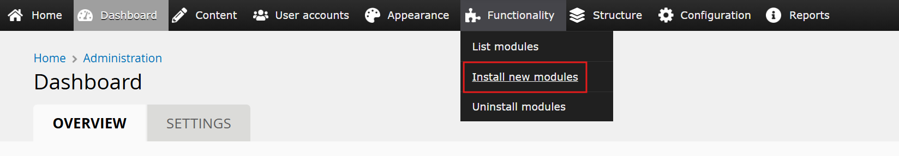

# All in One Accessibility™: Backdrop CMS Module

## Description
[All in One Accessibility](https://www.skynettechnologies.com/all-in-one-accessibility) AI Widget Supports 140 Languages and includes 70+ features. Screen Reader, Talk & Type, Voice Navigation, Dictionary, Virtual Keyboard, Accessibility Profiles, Sign language Libras (Brazilian Portuguese) Custom Widget Color, Icon size, Position, Talk & Type, GA4 Tracking and custom accessibility statement link are some of the top features.

Our AI automatically remediates images Alternative text and uses the accessibility interface which handles UI and design related adjustments. All in One Accessibility app enhances your website accessibility to people with hearing or vision impairments, motor impaired, color blind, dyslexia, cognitive & learning impairments, seizure and epileptic, and ADHD problems.

It improves website ADA compliance and browser experience for ADA, WCAG 2.1 & 2.2, Section 508, California Unruh Act, Australian DDA, European EAA EN 301 549, UK Equality Act (EA), Israeli Standard 5568, Ontario AODA, Canada ACA, German BITV, France RGAA, Brazilian Inclusion Law (LBI 13.146/2015), Spain UNE 139803:2012, JIS X 8341 (Japan), Italian Stanca Act and Switzerland DDA Standards.

Follows the best industry security, SEO practices and standards ISO 9001:2015 & ISO 27001:2013 and complies with GDPR, COPPA regulations. Member of W3C and International Association of Accessibility Professionals (IAAP). It is a flexible & lightweight widget that can be changed according to law and reduces the risk of time-consuming accessibility lawsuits.

Following features can be added as an addon:
- PDF/Document Remediation
- Modify Accessibility Menu
- White Label and Custom Branding
- Live Website Translations
- VPAT / ACR Report
- Manual Accessibility Audit
- Accessibility Monitor

For more details/features, Please visit [All in One Accessibility](https://www.skynettechnologies.com/all-in-one-accessibility).

## Installation

### Prerequisites
- Backdrop version v1.28.0

### Steps

Install the module using this instructions

Step 1 : Go to Admin -> Functionality -> Install new Module

Step 2 : In the Install new Module section, click on the sidebar link labeled Manual Installation.

Step 3 : Choose the All in One Accessibility zip file from your computer and Click Install

Step 4 : After Install Click the Enable newly added modules

Step 5 : Search and Enable the Module
1. In the module management page, search for All in One Accessibility.
2. Check the checkbox next to it.
3. Save the configuration.

Step 6 : To configure the module, click the Configure button next to the All in One Accessibility module.

## Configuration

Once you have registered the settings, you can visit the configuration page by navigating to Administration > Configuration > System > All in One Accessibility or directly go to admin/config/system/allinoneaccessibility.

## Live Demo
https://blackdrop.skynettechnologies.us/cms_backdrop/backdrop/

## Screenshots

## Video

## Acknowledgements

- [Backdrop CMS All in One Accessibility](https://www.skynettechnologies.com/backdrop-website-accessibility)
- [How to install All in One Accessibility Addon on Backdrop CMS](https://www.skynettechnologies.com/blog/backdrop-web-accessibility-widget-installation)

## Documentation

[All in One Accessibility - User Guide](https://www.skynettechnologies.com/sites/default/files/accessibility-widget-features-list.pdf)

## Submit a Support Request

Please visit our [support page](https://www.skynettechnologies.com/report-accessibility-problem) and fill out the form. Our team will get back to you as soon as possible.

## Send Us an Email

Alternatively, you can send an email to our support team:
[hello@skynettechnologies.com](mailto:hello@skynettechnologies.com)

## Partnership Opportunities

#### [Agency](https://www.skynettechnologies.com/agency-partners)

Partner with us as an agency to provide comprehensive accessibility solutions to your clients. Get access to exclusive resources, training, and support to help you implement and manage accessibility features effectively.

#### [Affiliate](https://www.skynettechnologies.com/affiliate-partner)

Join our affiliate program and earn commissions by promoting All in One Accessibility™. Share our Widget with your network and help businesses improve their website accessibility while generating revenue.

For more details, Please visit [Partnership Opportunities](https://www.skynettechnologies.com/partner-program)

## About

This addon is developed and maintained by [Skynet Technologies USA LLC](https://www.skynettechnologies.com)

